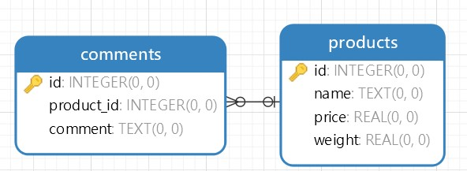

## AI Service Analytics Sentiment Product
This system analyzes product comments to transform text data into valuable insights on customer sentiment. By automatically classifying comments, it provides a clear overview of consumer opinions, helping you make better business decisions.

### Table of Contents
1.  **Introduction**
2.  **System Overview**
3.  **Core Components**
    * **Data Set & Labeling (`dataset.csv`)**
    * **Training AI Model (`training.py`)**
    * **AI Model (`sentiment_model.pkl`)**
    * **Data & Comments (SQL Database)**
    * **Calculate Sentiment (`calculate.py`)**
    * **API Service (`api.py`)**
    * **Application**
4.  **How It Works**

### 1. Introduction

Once upon a time, a startup wanted to understand its customers better. They had thousands of product reviews, but reading them all was impossible. They needed a hero—a smart system that could automatically read every comment and tell them how people really felt. This is the story of that hero: the **AI Service Analytics Sentiment Product**. It's a system designed to listen to every customer's voice and turn raw text into valuable business insights.

### 2. System Overview

The system operates in a clear, sequential flow. First, a labeled dataset is used to train an AI model. The trained model is saved and then integrated into a service that calculates sentiment for comments stored in a database. This analysis is then exposed via a REST API, allowing an external application to access the sentiment data.

### 3. Core Components

#### Data Set & Labeling (`dataset.csv`)

This is the foundation of our system. It's an Excel file containing raw text data (comments) that has been manually labeled with sentiment scores (e.g., positive, negative, neutral). This labeled data is crucial for teaching our AI model what different sentiments look like.

* *Insert Screenshot Here (e.g., of the `dataset.csv` file)*
* 

#### Training AI Model (`training.py`)

The `training.py` script uses the labeled `dataset.csv` to train an AI model. It learns the patterns and keywords associated with each sentiment category. The output of this process is a trained model file.

* *Insert Screenshot Here (e.g., of the `training.py` code or the terminal output showing a successful training run)*

#### AI Model (`sentiment_model.pkl`)

This is the result of the training process. The `.pkl` file is a saved, ready-to-use AI model. Instead of retraining the model every time, we can simply load this file to use its predictive capabilities.

* *Insert Screenshot Here (e.g., of the `sentiment_model.pkl` file in the folder)*

#### Data & Comments (SQL Database)

This component is the database where product and comment information is stored. The comments are the raw data that our system will analyze. The `calculate.py` script will query this database to get the comments.

* *Insert Screenshot Here (e.g., of the database schema or a table with product and comment data)*

#### Calculate Sentiment (`calculate.py`)

The `calculate.py` script acts as the core logic. It reads comments from the SQL database, loads the AI model (`sentiment_model.pkl`), and uses it to predict the sentiment of each comment. It then aggregates the results, counting the number of positive, neutral, and negative comments.

* *Insert Screenshot Here (e.g., of the `calculate.py` code)*

#### API Service (`api.py`)

The `api.py` script provides the REST API endpoint. It links the sentiment calculation logic to the outside world. An external application can send a request to this API (e.g., `GET /sentiment/{product_id}`), and the service will run `calculate.py` to return the sentiment analysis in a JSON format.

* *Insert Screenshot Here (e.g., of the `api.py` code)*

#### Application

This is the final user-facing part of the system. The application (e.g., a website or a mobile app) sends a request to the API Service. It then receives the sentiment data and displays it to the user, for example, by showing a chart or a summary of customer feedback.

* *Insert Screenshot Here (e.g., of the application's user interface displaying the sentiment results)*

### 4. How It Works

1.  **Training**: The `training.py` script trains the AI model using a labeled `dataset.csv`.
2.  **Analysis**: The `calculate.py` script fetches comments from the SQL database and uses the trained `sentiment_model.pkl` to analyze them.
3.  **API Call**: An external application makes a request to the `api.py` service.
4.  **Result**: The API service returns the sentiment analysis results in a JSON format.
